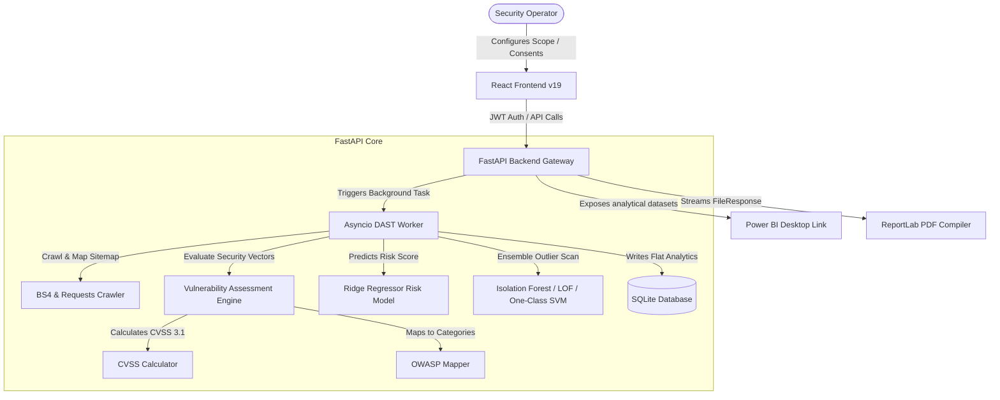
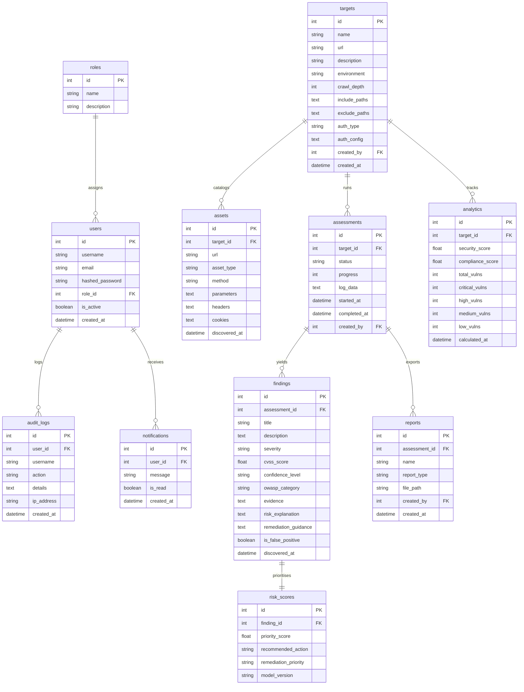

# RiskLens AI

> **Intelligent Security Assessment. Actionable Risk Insights.**

RiskLens AI is an enterprise-grade AI-Assisted DAST (Dynamic Application Security Testing) Web Security Analytics Platform designed to automate security audits, categorize vulnerabilities using OWASP guidelines, compute CVSS v3.1 scores, prioritize threats using machine learning regressors, detect scan trends anomalies, and compile high-fidelity PDF, HTML, and JSON reports with live Power BI data streams.

---

## 1. System Architecture

The following diagram illustrates the flow from target specification through background scanning, ML processing, and dashboard presentation.



---

## 2. Database ER Diagram

The SQLite database consists of 11 interrelated tables representing the operation telemetry.



---

## 3. Local Setup Instructions

### Prerequisites
- Python 3.9+
- Node.js 18+

### Backend Installation

1. Navigate to the `backend/` directory:
   ```bash
   cd backend
   ```
2. Create and activate a Python virtual environment:
   ```bash
   python3 -m venv venv
   source venv/bin/activate
   ```
3. Install the dependencies:
   ```bash
   pip install --upgrade pip
   pip install -r requirements.txt
   ```
4. Run the database initialization and seeding script (seeds demo accounts, sample targets, historical runs, and trains models):
   ```bash
   python init_db.py
   ```
5. Launch the FastAPI Uvicorn server:
   ```bash
   uvicorn app.main:app --reload --port 8000
   ```

### Frontend Installation

1. Navigate to the `frontend/` directory:
   ```bash
   cd ../frontend
   ```
2. Install the node packages:
   ```bash
   npm install
   ```
3. Run the frontend development build:
   ```bash
   npm run dev
   ```
4. Open your browser and navigate to the local address displayed (typically `http://localhost:5173`).

---

## 4. REST APIs & Power BI Feeds

The REST APIs are fully documented in the Swagger UI endpoint directory (available at `http://localhost:8000/docs`).

### Core Endpoints
- `POST /api/v1/auth/login`: Issue JWT authentication tokens.
- `POST /api/v1/auth/register`: Create user and select roles.
- `POST /api/v1/targets/`: Configure web application scope.
- `POST /api/v1/assessments/`: Start DAST security scan task.
- `POST /api/v1/reports/generate/{assessment_id}`: Compile PDF, HTML, JSON files.
- `GET /api/v1/reports/download/{report_id}`: Directly stream a compiled report to the browser.
- `GET /api/v1/analytics/powerbi/findings`: Expose flattened dataset for Power BI.

---

## 5. Production Deployment Guide

To deploy RiskLens AI into production without Docker:

### Backend Deployment (ASGI Gunicorn + Uvicorn)

1. Lock down permissions on the SQLite database file:
   ```bash
   chmod 600 risklens_ai.db
   ```
2. Set strong production environment variables:
   ```bash
   export SECRET_KEY="generate-a-strong-random-key"
   ```
3. Deploy the FastAPI app using Gunicorn with Uvicorn worker class:
   ```bash
   venv/bin/gunicorn app.main:app -w 4 -k uvicorn.workers.UvicornWorker --bind 127.0.0.1:8000
   ```
4. Setup a systemd service descriptor file (`/etc/systemd/system/risklens-backend.service`) to ensure the process restarts automatically.

### Frontend Deployment (Nginx)

1. Compile the production optimized static build:
   ```bash
   npm run build
   ```
2. Move the compiled outputs (located inside `dist/`) to your web server root:
   ```bash
   cp -r dist/* /var/www/risklens-app/
   ```
3. Configure Nginx to serve the build files and proxy `/api/` traffic to the backend:
   ```nginx
   server {
       listen 80;
       server_name risklens.yourdomain.com;

       location / {
           root /var/www/risklens-app;
           index index.html;
           try_files $uri $uri/ /index.html;
       }

       location /api/ {
           proxy_pass http://127.0.0.1:8000;
           proxy_set_header Host $host;
           proxy_set_header X-Real-IP $remote_addr;
       }
   }
   ```
4. Install an SSL certificate using Let's Encrypt Certbot:
   ```bash
   sudo certbot --nginx -d risklens.yourdomain.com
   ```
